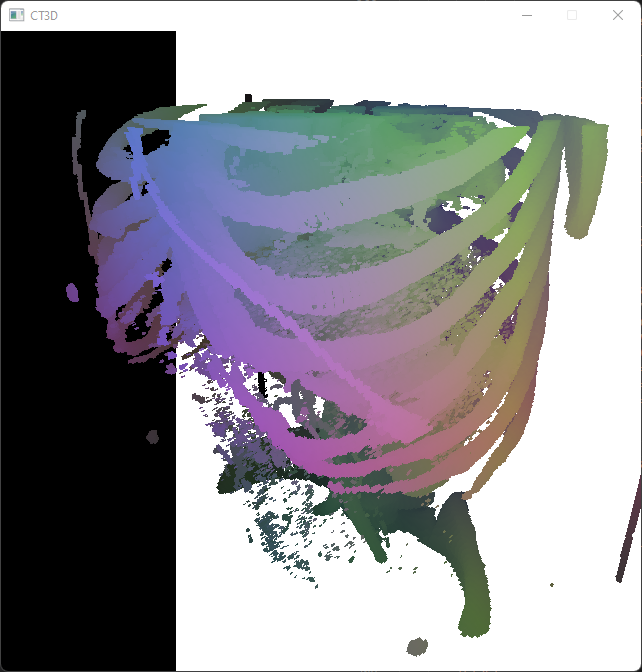

# CT3D

Software for the intelligent visualization and measurment of anatomical CT data. 

**Under Active Development**

## Features

* Load DICOM stacks using drag-and-drop
* Visualize CT data at varying cutoff density

## Usage

*Not available until initial release*
